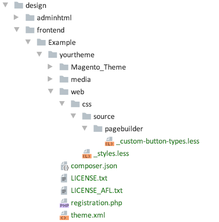

# Page Builder - Button Extension

In this example, we create a custom button type called Hollow. You can use this same pattern to create your own custom button types for all Page Builder content types that use buttons: Button, Banner, and Slide.


## Installation and usage

To install this module:

1. Copy the `Button` directory and all its contents into `app/code/` directory.
2. Command line into your `<magento-root>` directory and run `bin/magento setup:upgrade` to install the extension.
3. Navigate to a CMS page and drag a Button onto the stage.
4. Open the Button's editor and select the new Hollow button type provided by this example.
5. Create the matching CSS for your button type in your storefront theme as explained below.

## Create matching button type style for your storefront theme

To see your custom button types render on your storefront as they do within the Admin stage, you need to add the CSS from adminhtml (`_button.less`) to your own theme. For this example, we added a `_button.less` file to our own theme, as shown here:



If you want to create something similar to complete this example, here's the `less` for the theme's `_button.less` file shown above. This is the same `less` style

```scss
[data-content-type="button-item"], [data-content-type="banner"], [data-content-type="slide"] {
    a,
    button,
    div {
        &.pagebuilder-button-hollow {
            .lib-link-as-button();
            .lib-button(@_button-margin: 40px 10px 10px 0);
            .lib-button-l();
            .lib-css(border-radius, 0);
            box-shadow: none;
        }

        &.pagebuilder-button-hollow {
            font-size: 16px;
            font-weight: 600;
            line-height: 1.42;
            font-family: Poppins, sans-serif;
            padding: 14px 36px;
            cursor: pointer;
            border: 2px solid #333333;
            padding: 20px 36px 16px 36px;
            margin: 30px 0 10px 0;
            background: transparent;
            color: #333333;

            &:hover {
                background: #DDDDDD;
                border: 2px solid #333333;
            }
        }
    }
}
```

## Feedback

We encourage and welcome you to help us keep these examples current by submitting pull requests and issues. 
We also welcome your feedback and ideas on other code examples you would like to see added to this repo. 

## Slack
You can join our [#pagebuilder channel](https://magentocommeng.slack.com/messages/CHB455HPF), within [magentocommeng.slack.com](https://magentocommeng.slack.com/), to post your questions to the Page Builder community.
