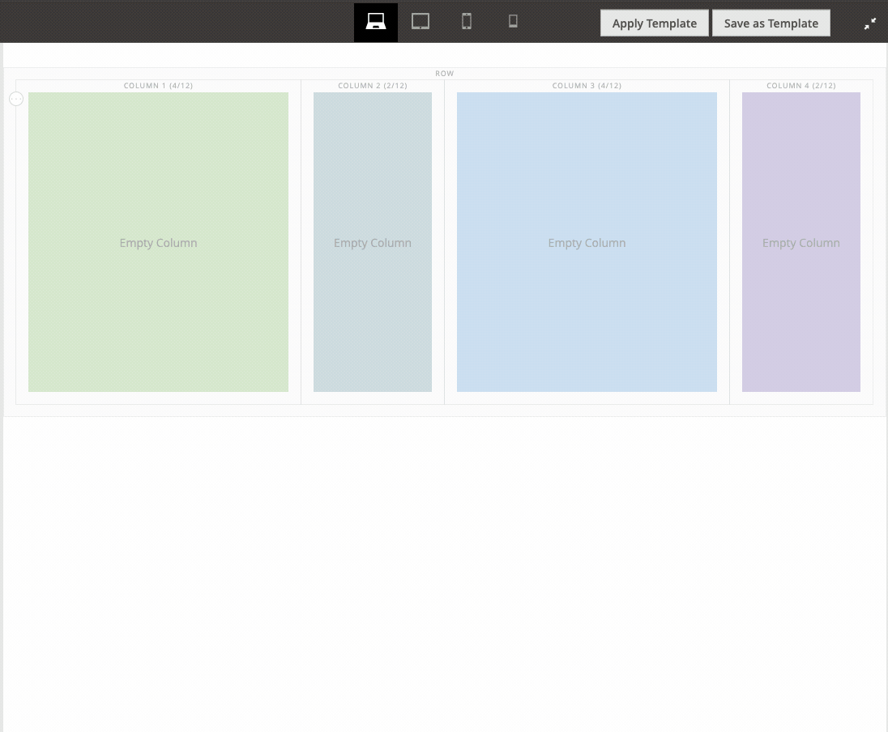

# Page Builder - Columns Extension

This module provides an example that shows how to use breakpoints to control the responsive layout of columns. Almost every file in the module is annotated with comments that explain what the files, code, and configurations do, so you can learn how to take full control of Page Builder columns for your content.

## Installation

These steps assume you have already cloned the `pagebuilder-examples` repo to the root of your Magento instance, as described in [Installing the example modules](https://github.com/commerce-docs/pagebuilder-examples/blob/master/README.md#installing-the-example-modules):

1. Navigate to to the `app/code/` directory and create a symlink using the following command:

    ```bash
    ln -s ../../pagebuilder-examples/Columns
    ```

1. From the Magento root directory, run the `setup:upgrade` command to install and enable the module:

   ```bash
   bin/magento setup:upgrade
   ```

## What it does

It does quite a bit. I'll add all the details soon. But until then, you can read the comments within the module files to get a pretty good idea of what's going on. Some code is only there to fix bugs in 1.6.0. If that's the case, I point it out in the comments. A good example is the `StageConfigFix` plugin. This fixes a configuration bug with the `stage` configuration for viewports.

### Four main features

1. Adds Tablet and a Mobile Small viewports to the default viewports (desktop and mobile).
1. Provides workarounds for four bugs in the latest release 1.6.0.
1. Allows you to set the number of columns per row you want to show for a breakpoint/viewport.
1. Allows you to hide specific columns for a breakpoint/viewport.

### Known limitations (so far)

If you hide certain columns, it can change the `columnsPerRow` layouts. For example, a mobile layout with `columnsPerRow` set to `2`, appears as a single column when you set the `columnToHide` (yes, bad name) to `1,4` (meaning hide columns number `1` and `4`). This happens because the flexbox wrapping flows from left to right, so column `2` is on the first row and column `3` is on the second row.

```xml
<var name="mobile">
    <var name="label">Mobile</var>
    ...
    <var name="options">
        <var name="columns">
            <var name="default">
                <var name="columnsPerRow">2</var>
                <var name="columnToHide">1,4</var>
            </var>
        </var>
    </var>
</var>
```

This GIF shows:

- How the mobile viewport (max-width: 768px) keeps the desktop column ratios in a 2-column format.
- How columns can be hidden for viewports/breakpoints. The tablet viewport is configured to hide the 4th column. All other viewports show all columns.



More docs to come.

## Author

[Bruce Denham](https://github.com/bdenham). Contact us on the Slack [#pagebuilder channel](https://slack.com/app_redirect?channel=pagebuilder) for questions specific to this example.

## Feedback

We encourage and welcome you to help us keep these examples current by submitting Issues and Pull Requests. We also welcome your feedback and ideas on other code examples you would like to see added to this repo.
