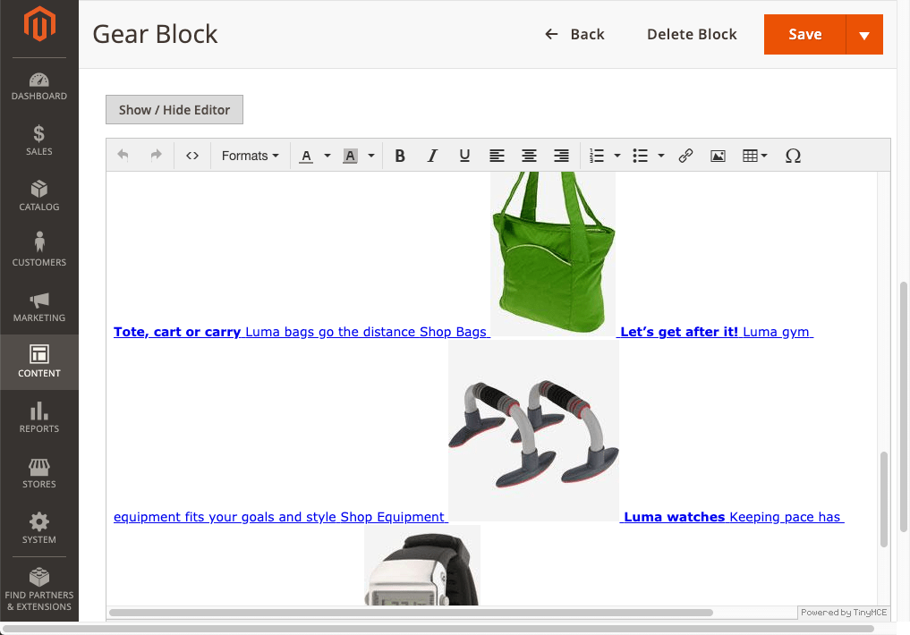

# Deactivate Page Builder

While you cannot disable Page Builder for a specific CMS Page or Block, you can disable Page Builder for CMS Pages only or CMS Blocks only. This can be useful for when you want to use Page Builder to create new CMS Pages, but don't want Page Builder to change your existing CMS Blocks. For example, you may have CMS Blocks that you created before installing Page Builder with Magento Commerce 2.3.1+ and you don't want Page Builder to wrap your block content within a row as it does by default (which adds div tags that may affect your block designs). This example module shows you how to do just that.

## Installation and usage

To install this module:

1. Copy the `Deactive` directory and all its contents into the `app/code/` directory.
2. Command line into your `<magento-root>` directory and run `bin/magento setup:upgrade` to install the extension.
3. Navigate to a CMS Block page and view the WYSIWYG editor without Page Builder.

    

## Discussion

By default, this module disables Page Builder for CMS Blocks (`cms_block_form.xml`). The module also includes the Dynamic Blocks form (`banner_form.xml`) and Pages form (`cms_block_form.xml`) to show how you can disable Page Builder for those areas as well:


With Magento's XML merging, the module simply adds `is_pagebuilder_enabled` (boolean) to the Admin's `content` form fields for Blocks, Dynamic Blocks, and Pages, as shown here:

```xml
<form xmlns:xsi="http://www.w3.org/2001/XMLSchema-instance" xsi:noNamespaceSchemaLocation="urn:magento:module:Magento_Ui:etc/ui_configuration.xsd">
    <fieldset name="general">
        <field name="content" formElement="wysiwyg">
            <argument name="data" xsi:type="array">
                <item name="config" xsi:type="array">
                    <item name="wysiwygConfigData" xsi:type="array">
                        <!-- Enable and disable Page Builder here -->
                        <item name="is_pagebuilder_enabled" xsi:type="boolean">false</item>
                    </item>
                </item>
            </argument>
        </field>
    </fieldset>
</form>
```

## Feedback

We encourage and welcome you to help us keep these examples current by submitting pull requests and issues.
We also welcome your feedback and ideas on other code examples you would like to see added to this repo.

## Slack
You can join our [#pagebuilder channel](https://magentocommeng.slack.com/messages/CHB455HPF), within [magentocommeng.slack.com](https://magentocommeng.slack.com/), to post your questions to the Page Builder community.
