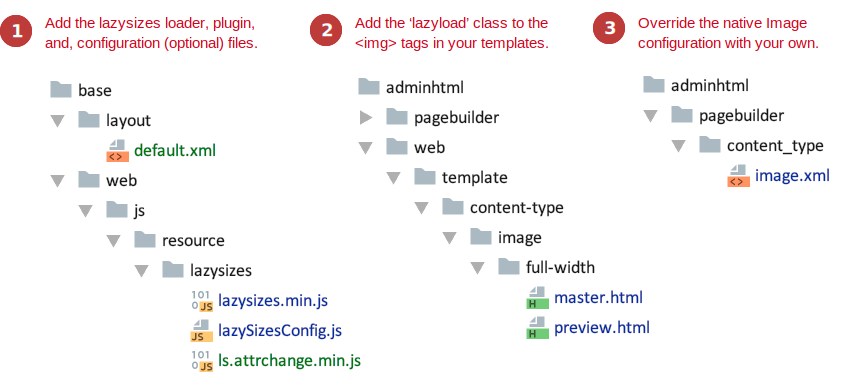

# PageBuilderLazyLoading

This module shows how to add lazy loading behavior to the Image content type. For this example, we use the [lazysizes](https://github.com/aFarkas/lazysizes) loader. The module also supports native lazy loading using the lazysizes [native-loading plugin](https://github.com/aFarkas/lazysizes/tree/gh-pages/plugins/native-loading). But, as of this writing, the `nativeLoading` plugin (v 5.1.1) seems to mess with the lazysizes loader, so I commented it out.

## Installation and usage

To install this extension module:

1. Copy the `PageBuilderLazyLoading` directory and all its contents into a new (or your existing) `Example` vendor directory: `<magento-root>/app/code/Example`.
2. Command line into your `<magento-root>` directory and run `bin/magento setup:upgrade` to install the extension.
3. Drag and drop several Image content types onto the stage, upload images to each, and Save.
4. Open the Network tab in Chrome's devtools and watch the magic (you should see `lazysizes.js` as the initiator for your images). 

## Discussion

Adding lazy loading (using [lazysizes](https://github.com/aFarkas/lazysizes)) to the Page Builder Image content type turns out to be easy. There's very little coding involved and only a few small changes to the native Image content type configuration and HTML templates. 

There are three main tasks:

1. Adding the `lazysizes` loader to your module.
2. Adding the `lazyload` class to your `master.html` and `preview.html` templates.
3. Overriding Page Builder's native Image config (`image.xml`).




### Adding `lazysizes`

First, we add the `lazysizes` lazy loader to our module in the `base` directory. By adding it to the base directory, Magento makes the loader available within the admin on the Page Builder stage and on the storefront where it really matters.

There are several approaches you could take to adding the `lazysizes` loader to your own module. But the approach that seems easiest is to include it within the `<head>` of both admin and frontend pages using the `default.xml` layout, as shown here:

```xml
<page xmlns:xsi="http://www.w3.org/2001/XMLSchema-instance" layout="admin-1column" xsi:noNamespaceSchemaLocation="urn:magento:framework:View/Layout/etc/page_configuration.xsd">
    <head>
        <script src="Example_PageBuilderLazyLoading/js/resource/lazysizes/lazySizesConfig.js"></script>
        <script src="Example_PageBuilderLazyLoading/js/resource/lazysizes/lazysizes.min.js"></script>
        <script src="Example_PageBuilderLazyLoading/js/resource/lazysizes/ls.attrchange.min.js"></script>

        <!-- CDN --> 
        <!--<script src="https://cdnjs.cloudflare.com/ajax/libs/lazysizes/5.1.1/lazysizes.min.js" src_type="url"></script>-->
        <!--<script src="https://cdnjs.cloudflare.com/ajax/libs/lazysizes/5.1.1/plugins/attrchange/ls.attrchange.min.js" src_type="url"></script>-->
    </head>
</page>
```

This example uses local copies of the lazysizes loader (`lazysizes.min.js`) and plugin (`ls.attrchange.min.js`).
You can instead use [CDN versions](https://cdnjs.com/libraries/lazysizes) for the lazysizes loader and all its plugins.

The `lazySizesConfig.js` file is optional. But you must be load it first if you use it. This is the recommended way to add your custom configurations, as shown here:

```js
(function () {
    window.lazySizesConfig = window.lazySizesConfig || {};
    window.lazySizesConfig.loadMode = 1;
    window.lazySizesConfig.expand = 0;
})();
```

To learn more about configuring the lazysizes loader, see: https://github.com/aFarkas/lazysizes#js-api. 


### Adding `lazyload` classes

Copy the `master.html` and `preview.html` templates from Page Builder's native Image content type. Then  add the `lazyload` class to the existing classes on the `` tags, as shown in the snippet here:

```html

        
    <type name="image">
        <appearances>
            <appearance default="true"
                        name="full-width"
                        preview_template="Example_PageBuilderLazyLoading/content-type/image/full-width/preview"
                        master_template="Example_PageBuilderLazyLoading/content-type/image/full-width/master">
                <elements>
                    <element name="desktop_image">
                        <attribute name="image" source="data-src" converter="Magento_PageBuilder/js/converter/attribute/src" preview_converter="Magento_PageBuilder/js/converter/attribute/preview/src"/>
                    </element>
                    <element name="mobile_image">
                        <attribute name="mobile_image" source="data-src" converter="Magento_PageBuilder/js/converter/attribute/src" preview_converter="Magento_PageBuilder/js/converter/attribute/preview/src"/>
                    </element>
                </elements>
            </appearance>
        </appearances>
    </type>
</config>
```

That's all there is to it! 

Instead of using `lazysizes`, you should be able to use other lazyloaders (like [lozad](https://github.com/ApoorvSaxena/lozad.js)) using a very similar approach:

1.  Add `lozad.js` file to your module or use a CDN.
2.  Add the 'lozad' class to your template img tags.
3.  Override the native Image configuration to point to your templates and use `data-src` instead of `src` for you desktop and mobile image sources. 

## Feedback

We encourage and welcome you to help us keep these examples current by submitting pull requests and issues. We also welcome your feedback and ideas on other code examples you would like to see added to this repo. 

## Slack
You can join our [#pagebuilder channel](https://magentocommeng.slack.com/messages/CHB455HPF), within [magentocommeng.slack.com](https://magentocommeng.slack.com/), to post your questions to the Page Builder community.
