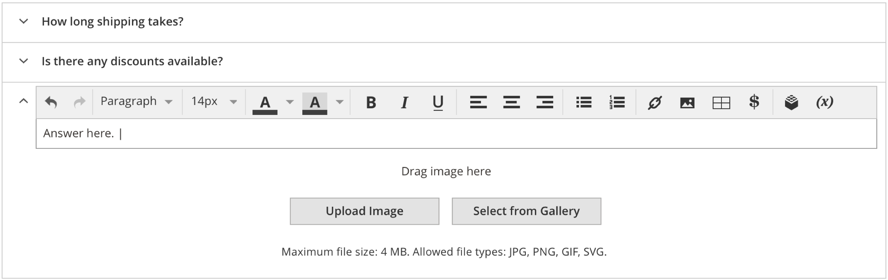

# Page Builder - Custom FAQ module.



These steps assume you have already cloned the `pagebuilder-examples` repo to the root of your Magento instance, as described in [Installing the example modules](../../README.md):

1. Navigate to to the `app/code/` directory and create a symlink using the following command:

    ```bash
    ln -s ../../pagebuilder-examples/FAQ
    ```

1. From the Magento root directory, run the `setup:upgrade` command to install and enable the module:

   ```bash
   bin/magento setup:upgrade
   ```

1. Drag and drop an FAQ content type to the stage and start entering content.

## Author

[Igor Melnikov](https://github.com/melnikovi). Contact us on the Slack [#pagebuilder channel](https://slack.com/app_redirect?channel=pagebuilder) for questions specific to this example.

## Feedback

We encourage and welcome you to help us keep these examples current by submitting Issues and Pull Requests. We also welcome your feedback and ideas on other code examples you would like to see added to this repo.
