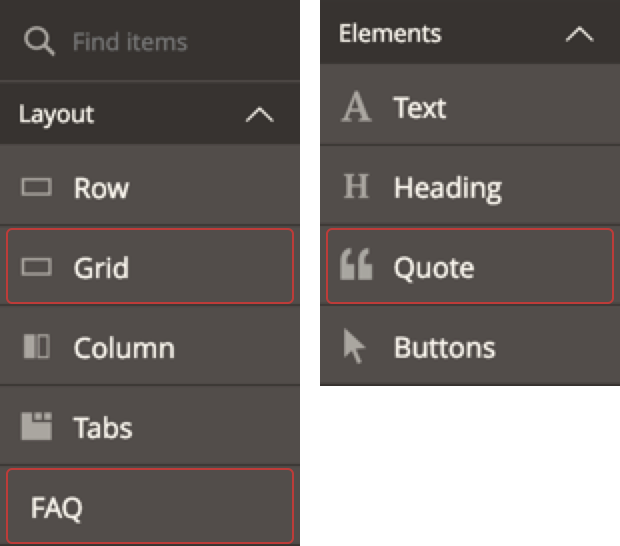

# Page Builder Examples

This repo is a collection of Page Builder content type modules created to teach you how Page Builder content types work. The examples will help you learn by example, and teach you best practices for developing custom Page Builder modules.

**NOTE**: The code examples included in this repository are only compatible with Magento 2.3.1 with Page Builder 1.0.0 installed.

## Installation

Assuming you have Page Builder 1.0.0 already installed and activated, you can install these example modules as you do any other Magento module. 

1. Create a directory named `Example` within the `app/code/` directory.
2. Copy `PageBuilderQuote`, `PageBuilderGrid`, and `PageBuilderFaq` into the `Example` directory. This ensures the module names will resolve because each Module is registered with the `Example_` prefix.
3. Enable the modules using the following command:

   ```bash
   bin/magento setup:upgrade
   ```
   
4. Navigate to a Page Builder instance to ensure the example content types appear in the Page Builder panel as shown here:

    
    

## Contributing

You are welcome to submit PRs to help us improve and/or update these Page Builder examples. We also welcome your feedback and ideas about creating other code examples to add to this repo. 
