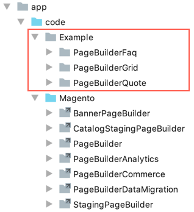

# Page Builder Examples

This repo is a collection of Page Builder content type modules created to teach you how Page Builder content types work. The modules will help you learn by example, and teach you best practices for developing custom Page Builder modules.

**NOTE**: The code examples included in this repository are only compatible with Magento 2.3.1 with Page Builder 1.0.0 installed.

## Example Modules

The Page Builder team members created these modules to serve as examples for learning. They are not fully tested or guaranteed to work perfectly. However, we will do our best to improve these examples and keep them updated with the latest releases of Page Builder.

- **[PageBuilderExtensionSlider](https://github.com/magento-devdocs/pagebuilder-examples/tree/master/Example/PageBuilderExtensionSlider)** — Created by [Bruce Denham](https://github.com/bdenham). This module shows you how to add `centerMode` and `centerPadding` settings from the [slick carousel](https://kenwheeler.github.io/slick/) used by the Slider.

- **[PageBuilderExtensionBanner](https://github.com/magento-devdocs/pagebuilder-examples/tree/master/Example/PageBuilderExtensionBanner)** — Created by [Bruce Denham](https://github.com/bdenham). This module shows you how to customize an existing content type: the Banner. This is the completed module featured in the [Extend a content type tutorial](https://devdocs.magento.com/page-builder/docs/extend-existing-content-type/overview.html).

- **[PageBuilderQuote](https://github.com/magento-devdocs/pagebuilder-examples/tree/master/Example/PageBuilderQuote)** — Created by [Bruce Denham](https://github.com/bdenham). This module shows you how to create a content type for a customer testimonial page. This is the completed Quote module featured in the [Create a content type tutorial](https://devdocs.magento.com/page-builder/docs/create-custom-content-type/overview.html).

- **[PageBuilderGrid](https://github.com/magento-devdocs/pagebuilder-examples/tree/master/Example/PageBuilderGrid)** — Created by [Dave Macaulay](https://github.com/davemacaulay). This module shows you how to create a content type that recreates the layout of the Magento Luma-themed home page using a grid structure with grid items.

- **[PageBuilderFaq](https://github.com/magento-devdocs/pagebuilder-examples/tree/master/Example/PageBuilderFaq)** — Created by [Igor Melnikov](https://github.com/melnikovi). This module shows you how to create a content type for an FAQ page that uses an accordion for the questions and answers.

## Modules Installation

Assuming you have Page Builder 1.0.* already installed and activated, you can install these example modules as you do any other Magento module. 

1. Copy or symlink the `Example` directory into your Magento installation's `app/code` directory, as shown here:

    **To Symlink**:
    ```terminal
    ln -s <Relative_route_to_cloned_Example_directory>
    ```
    
    
    
2. Enable the modules using the following command:

   ```bash
   bin/magento setup:upgrade
   ```
   
3. Navigate to a Page Builder instance to ensure the example content types appear in the Page Builder panel as shown here:

   
    

## Contributing

We encourage and welcome you to help us keep these examples current by submitting PRs and issues. 
We also welcome your feedback and ideas about creating other code examples to add to this repo. 
