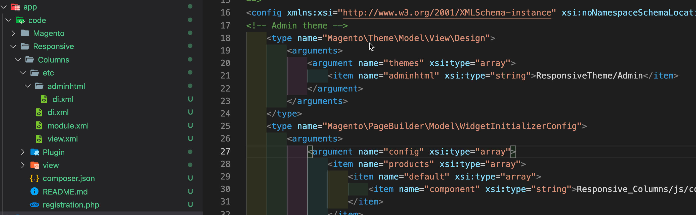

# Responsive Columns

This module provides a Page Builder example module that shows how to use breakpoints to create responsive columns. Almost every file in the module is annotated with comments that explain what the code and configurations do, so you can learn how to take full control of Page Builder columns for your content.

## Installation

1. Install the [ResponsiveTheme](../../ResponsiveTheme/README.md). It adds a critical fix to the mobile viewport.

1. Add this module to the `app/code/` directory in your Magento instance.

    

1. Run `bin/magento setup:upgrade` to install it.

## What it does

It does quite a bit. I'll add all the details soon. But until then, you can read the comments within the module files to get a pretty good idea of what's going on. Some code is only there to fix bugs in 1.6.0. If that's the case, I point it out in the comments. A good example is the `StageConfigFix` plugin. This fixes a configuration bug with the `stage` configuration for viewports.

**Four main features:**

1. Adds Tablet and a Mobile Small viewports to the default viewports (desktop and mobile).
1. Provides workarounds for four bugs in the latest release 1.6.0.
1. Allows you to set the number of columns per row you want to show for a breakpoint/viewport.
1. Allows you to hide specific columns for a breakpoint/viewport.

### Known limitations (so far)

If you hide certain columns, it can change the `columnsPerRow` layouts. For example, a mobile layout with `columnsPerRow` set to `2`, appears as a single column when you set the `columnToHide` (yes, bad name) to `1,4` (meaning hide columns number `1` and `4`). This happens because the flexbox wrapping flows from left to right, so columns `2` and `3` are on two different rows.

```xml
<var name="mobile">
    <var name="label">Mobile</var>
    ...
    <var name="options">
        <var name="columns">
            <var name="default">
                <var name="columnsPerRow">2</var>
                <var name="columnToHide">1,4</var>
            </var>
        </var>
    </var>
</var>
```

This GIF shows:

- How the mobile viewport (max-width: 768px) keeps the desktop column ratios in a 2-column format.
- How columns can be hidden for viewports/breakpoints. The tablet viewport is configured to hide the 4th column. All other viewports show all columns.


More docs to come.
