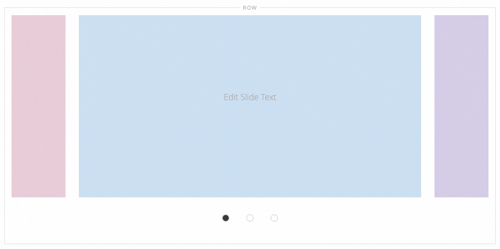

# PageBuilderExtensionSlider

Under the hood, the Page Builder Slider uses the [slick carousel](https://kenwheeler.github.io/slick). In this example, we show you how to add two [slick settings](https://kenwheeler.github.io/slick/#settings) not included in the native Page Builder Slider: `centerMode` and `centerPadding`, as shown here:



_Slider Center Mode and Padding from slick_

## Installation and usage

These steps assume you have already cloned the `pagebuilder-examples` repo to the root of your Magento instance, as described in [Installing the example modules](../../README.md):

1. Navigate to to the `app/code/` directory and create a symlink using the following command:

    ```bash
    ln -s ../../pagebuilder-examples/Slider
    ```

1. From the Magento root directory, run the `setup:upgrade` command to install and enable the module:

   ```bash
   bin/magento setup:upgrade
   ```

1. Navigate to a CMS, drag a Slider onto the Admin stage, and add at least three Slides.

1. Open the Slider Editor, turn on the **Center Mode** setting, and adjust the **Center Padding** as desired.

1. **Save** the form settings and view your new center-mode Slider in action.

## Author

[Bruce Denham](https://github.com/bdenham). Contact us on the Slack [#pagebuilder channel](https://slack.com/app_redirect?channel=pagebuilder) for questions specific to this example.

## Feedback

We encourage and welcome you to help us keep these examples current by submitting Issues and Pull Requests. We also welcome your feedback and ideas on other code examples you would like to see added to this repo.
