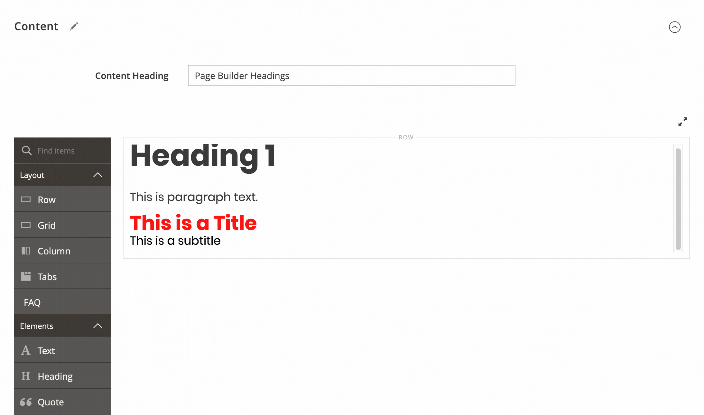

# Page Builder Text Extension

Under the hood, the Page Builder Text content type uses the [TinyMCE WYSIWYG HTML Editor](https://www.tiny.cloud/docs-4x/). In this example, we show you how to:

* Add and remove buttons from the [TinyMCE toolbar](https://www.tiny.cloud/docs/advanced/editor-control-identifiers/#toolbarcontrols)
* Integrate your theme's typography into the [TinyMCE Formats selector](https://www.tiny.cloud/docs/configure/content-formatting/#formattype)
* Add the [TinyMCE code plugin](https://www.tiny.cloud/docs/plugins/code/) (< >) to the toolbar so you can view the HTML code directly.



_Text content type showing theme styles_

## Installation and usage

These steps assume you have already cloned the `pagebuilder-examples` repo to the root of your Magento instance, as described in [Installing the example modules](../../README.md):

1. Navigate to to the `app/code/` directory and create a symlink using the following command:

    ```bash
    ln -s ../../pagebuilder-examples/Text
    ```

1. From the Magento root directory, run the `setup:upgrade` command to install and enable the module:

   ```bash
   bin/magento setup:upgrade
   ```

1. Navigate to a CMS page, drag a `Text` content type onto the Admin stage, and click the **Formats** selector in the toolbar to see your theme styles displayed.

1. Enter some text, then click the `code` button (< >) in the toolbar to view the HTML.

## Author

[Bruce Denham](https://github.com/bdenham). Contact us on the Slack [#pagebuilder channel](https://slack.com/app_redirect?channel=pagebuilder) for questions specific to this example.

## Feedback

We encourage and welcome you to help us keep these examples current by submitting Issues and Pull Requests. We also welcome your feedback and ideas on other code examples you would like to see added to this repo.
