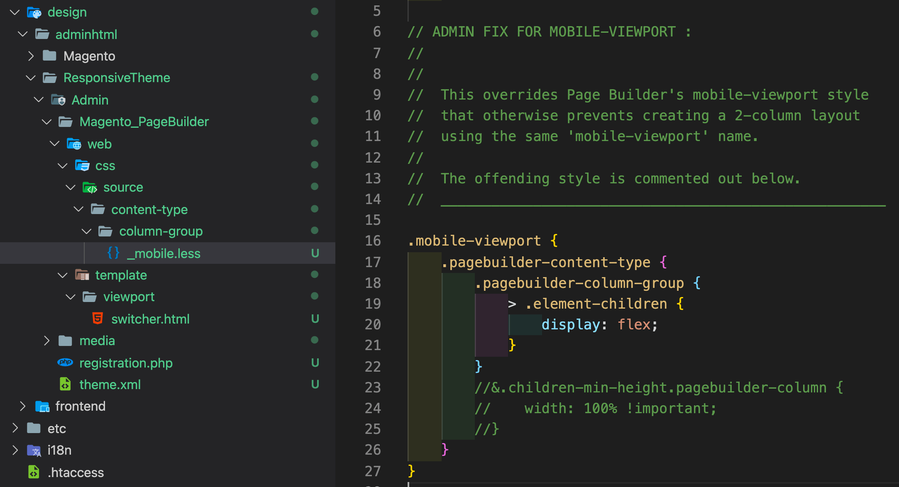
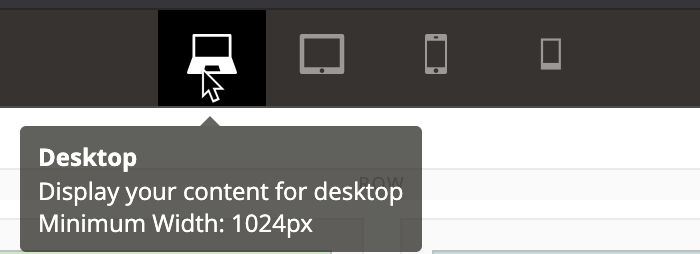

# Page Builder Admin Theme

This Admin theme is only required for the `Columns_Extension` module because it fixes a Page Builder style that prevents the `mobile` breakpoint from having more than one column. This will be fixed in Page Builder core in a future update. But until then, you can use this theme or add the fix to your own Admin theme.

## Installation

These steps assume you have already cloned the `pagebuilder-examples` repo to the root of your Magento instance, as described in [Installing the example modules](../../README.md):

1. Navigate to to the `app/design/adminhtml/` directory, then use the following symlink command:

    ```bash
    ln -s ../../../pagebuilder-examples/Theme
    ```

1. From the Magento root directory, run the `setup:upgrade` command to install and enable the module:

   ```bash
   bin/magento setup:upgrade
   ```

## What it does

When installed, this theme module updates your Magento instance in two ways:

1. Overwrites the `_mobile.less` file to remove the `width: 100% !important;` rule in the `.mobile-viewport` class, shown commented out here:

    

    This is necessary if you want more than one column for your mobile breakpoint (`max-width: 768px`). It will be fixed in a future Page Builder update.

1. Modifies the `switcher.html` template. Page Builder uses this template for its viewport switcher buttons and tooltips.

    

## Author

[Bruce Denham](https://github.com/bdenham). Contact us on the Slack [#pagebuilder channel](https://slack.com/app_redirect?channel=pagebuilder) for questions specific to this example.

## Feedback

We encourage and welcome you to help us keep these examples current by submitting Issues and Pull Requests. We also welcome your feedback and ideas on other code examples you would like to see added to this repo.
